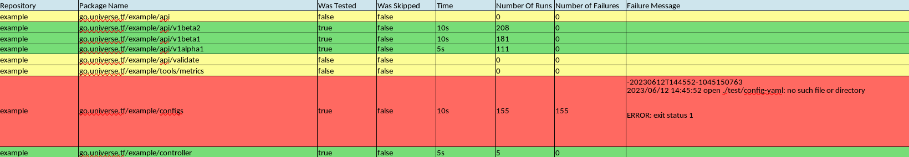

# Multi Stress Test


The purpose of this tool is to conduct mass stress testing in order to identify flaky unit tests, as described in the [Deflaking Unit Tests Documentation](https://github.com/kubernetes/community/blob/master/contributors/devel/sig-testing/flaky-tests.md#deflaking-unit-tests).

The tool executes [go stress](https://pkg.go.dev/golang.org/x/tools/cmd/stress) command on all packages located in the specified directories or git repositories. Running the stress command can be helpful when searching for test failures. This tool is particularly useful for broad searches aimed at improving maintainability.

## Flow

The tool takes a list of directories and repositories as input. It provides an option to use a local directory or a repository link. In the latter case, the tool clones the repositories to a temporary folder or a folder specified by the user. For each repository or directory, the tool generates a list of all packages. It then runs the stress command on each package that contains tests (discovered by running `go test`). Although primarily designed for unit tests, the tool can be used for other types of tests as well. The test results are added to a report, which is saved at the user-specified path.

## Prerequisites

To use this tool, you need to have the Go stress tool installed. To install it, run the following command: 

```
go install golang.org/x/tools/cmd/stress@latest
```

Then you can install the tool by:

```
go install github.com/AlinaSecret/multi-stress-test/cmd/multi-stress@latest
```

## Usage

The tool requires two parameters: a path to a YAML file containing a list of repositories and directories to test, and a path to a file where the report will be saved (path should end with .xlsx).

```
usage: multi-stress [-h|--help] -y|--yaml "<value>" [-o|--output "<value>"]
                    [-t|--time <integer>] [-p|--parallel <integer>]
                    [-w|--workers <integer>] [-d|--directory "<value>"]
                    [-v|--verbose]

                    Command-line application

Arguments:

  -h  --help       Print help information
  -y  --yaml       Path to the YAML file containing the list of repositories
                   and directories to test
  -o  --output     Path to the output file where the report will be saved should end with xlsx
  -t  --time       Time duration for stress test per package (in seconds).
                   Default: 10
  -p  --parallel   Number of parallel processes to run stress tests per
                   package. Default: 8
  -w  --workers    Number of packages to run stress tests in parallel (should
                   be synchronized with the number of parallel processes per
                   package). Default: 3
  -d  --directory  Directory to clone all repositories. If not specified,
                   repositories will be cloned in a temporary directory that
                   will be deleted
  -v  --verbose    Enable verbose logging. Default: false

```

## YAML Structure

Here is an example:
(you don't have to specify both repositories and directories if you want you can ues only one of them)
```yaml
Repositories:
  - git@github.com:exampleuser/repository1.git
  - git@github.com:exampleuser/repository2.git
  - git@github.com:exampleuser/repository3.git
  - git@github.com:exampleuser/repository4.git
Directories:
  - /path/to/repository1
  - /path/to/repository2
  - /path/to/repository3
  - /path/to/repository4
  ```

## Reading the Report

The report is presented in tabular form, where each row represents a Go package. The following information is included for each package:

- **Repository**: The repository of the package.
- **Package Name**: The full name of the package.
- **Test Run Count**: The number of times the tests were run.
- **Tested**: Indicates whether the package contains tests. If there are no tests, this value is set to false.
- **Skipped**: Indicates whether this package was skipped (currently not supported but included for future usage).
- **Time**: The duration of the test run.
- **Failures**: The number of times the tests failed.
- **Failure Message**: If a failure occurs, the error message will appear in this column.

The rows are color-coded: green for successful tests, yellow for packages without tests or skipped packages, and red for test failures.

Here is an example report:



## Disclaimer

This tool is a basic project and lacks features such as skipping specific packages, custom configuration of parameters per repository or directory, and unit test support.